# Pipeline Design: Vetted End-to-End Flow

How this project turns a set of GMKF Kids First **per-trio VCFs** into a ranked list of
high-priority rare variants and candidate genes — and *why* each step is shaped the way it is.

> Part of the high_priority_rare_variant methods reference. Thresholds referenced here are the
> configurable defaults defined in [Canonical defaults](README.md#canonical-defaults).

This document does two things:
1. **Vets the originally-proposed 5-step flow** for efficiency, accuracy, and logical soundness.
2. **Specifies the adjusted, defensible flow** we will implement, with the data artifact each
   step produces.

---

## TL;DR — verdict on the original proposal

The original flow is **logically sound and efficient in its backbone** (annotate the *union of
sites once*, then push work down to per-trio genotypes). It needs four corrections to be
defensible:

1. **Normalization is mandatory and must come first.** Split multiallelics and left-align indels
   (`bcftools norm -m- -f ref`) on every trio *before* any union or annotation, or the "same"
   variant exists in multiple representations and dedup/annotation joins silently fail.
2. **The cohort site file must be a site-only *union*, never a genotype `merge`.** Merging
   non-jointly-genotyped trios **fabricates hom-ref genotypes** (absent ≠ hom-ref), so any
   internal AC/AN is fiction. Use `view -G` + `concat -a -D`. See
   [cohort_construction.md](cohort_construction.md).
3. **The "subset merged VCF" (step 3) must not become a cohort genotype matrix used for
   frequency.** Keep **per-trio** subset VCFs as the authoritative unit for inheritance; the
   only legitimate cohort frequency is **external gnomAD v4.1 faf95**.
4. **"Genes with more variants than expected" (step 5) is a statistical statement, not a raw
   count.** Expectation must come from a **per-gene mutation-rate model** (de novo enrichment)
   and/or an ancestry/coverage-matched external-control burden test, calibrated so the
   synonymous class shows no enrichment (λ ≈ 1). Weight nominees by **gene constraint**.

Add two things the original flow omits: a **QC gate 0** (per-trio sex/relatedness/Mendelian-error
checks — garbage in, garbage out) and an honest statement of **scope limitations** (SNV/indel
only; CNV/SV, pseudogene regions, and proband mosaicism are known blind spots).

---

## Step-by-step vetting of the original 5-step proposal

| # | Original step | Verdict | Required change |
|---|---------------|---------|-----------------|
| 1 | Site-only VCF per input → merge + sort → cohort site-only VCF; VEP-annotate the merge | **Keep — efficient & correct in spirit** | Normalize each trio first (`norm -m- -f`); build the union with `view -G` + `concat -a -D` (**not** `merge`); strip incomparable per-trio `INFO`/`FILTER`; annotate once with the full stack (VEP + gnomAD faf95 + dbNSFP + SpliceAI + LOFTEE + ClinVar + constraint + gene-lists), not VEP alone |
| 2 | Select variants meeting minimal biological plausibility (AF, MODERATE+ impact, CADD, pathogenic, a-priori genes; exclude non-PASS) → plausible merged VCF | **Keep** | Make it **inheritance-agnostic** and use the **permissive-union** rarity gate (looser of dominant/recessive) so nothing needed by *some* mode is dropped early; exclude only clearly-benign (BA1 faf95 ≥ 0.05, or benign in-silico with no clinical flag); **always keep ClinVar P/LP** regardless of impact; treat a-priori gene lists as a *prior/tier*, never a hard include/exclude ("never-drop rule") |
| 3 | Extract these variants from individual files → subset merged VCF of variants of interest | **Keep the extraction; change the "merge"** | Extract plausible-site genotypes from each trio's **refined** VCF (recovers real `PP`/`GQ`/`DP`/`AD`/`hiConfDeNovo`); **transfer annotations** onto each trio with `bcftools annotate -a cohort.sites.annotated`; keep **per-trio** subset VCFs as the unit — do **not** compute frequency from a genotype-merged cohort VCF |
| 4 | Screen each pedigree with pedigree-aware inheritance + basic genotype QC → candidate variants | **Keep — this is the core** | Use refined `PP`-derived GQ; per-mode genotype rules (de novo / AR-hom / comp-het-in-trans / X-linked) with GQ ≥ 20, DP ≥ 10, het AB 0.25–0.75; de novo = `hiConfDeNovo` **re-verified** with DP/AB + parental cleanliness; add the **gnomAD-prior suppression cross-check** for top candidates |
| 5 | Screen across pedigrees for genes with multiple candidates, accounting for constraint | **Keep the goal; sharpen the statistics** | Replace raw counting with **de novo enrichment vs Samocha per-gene mutation model** (denovolyzeR; primary) + **TRAPD** vs ancestry/coverage-matched gnomAD (corroborative); **calibrate** with synonymous λ ≈ 1; correct for multiple testing (2.5e-6 / BH q < 0.05); **rank/weight by constraint** (a gene tolerant of damage is uninteresting) |

**Efficiency logic (why this ordering is right):** annotation (VEP + plugins) is the most
expensive operation and its cost scales with the number of *distinct sites*, not samples.
Annotating the **de-duplicated union once** (step 2) and then filtering to a small
**plausible-sites list** (step 3) before touching per-trio genotypes (step 4) minimizes total
compute and keeps the expensive per-genotype work proportional to the handful of sites that
survived. The original proposal already had this instinct; the corrections keep it *correct*.

---

## Adjusted flow (what we implement)

```mermaid
flowchart TD
    A[Per-trio refined VCFs<br/>GRCh38, GATK genotype-refinement] --> Q0

    subgraph S0[Step 0 — QC gate]
      Q0[Peddy sex + relatedness + IBS0<br/>genome-wide Mendelian-error < 2%<br/>drop/flag swapped trios]
    end
    Q0 --> N[Normalize each trio<br/>bcftools norm -m- -f ref]

    N --> S1
    subgraph S1[Step 1 — Cohort site list]
      C1[view -G  → site-only per trio PASS] --> C2[concat -a -D + sort + norm -d<br/>strip per-trio INFO/FILTER] --> C3[(cohort.sites.vcf.gz)]
    end

    C3 --> S2
    subgraph S2[Step 2 — Annotate ONCE]
      AN[VEP + LOFTEE + gnomAD v4.1 faf95<br/>+ dbNSFP REVEL/AlphaMissense/CADD/MPC<br/>+ SpliceAI + ClinVar dated + constraint + gene-lists] --> A2[(cohort.sites.annotated.vcf.gz)]
    end

    A2 --> S3
    subgraph S3[Step 3 — Select plausible sites]
      P1[rarity permissive-union + functional tier<br/>keep ClinVar P/LP; drop BA1-common<br/>gene lists as prior, never-drop] --> P2[(plausible.sites.vcf.gz  = target list)]
    end

    P2 --> S4
    N --> S4
    subgraph S4[Step 4 — Per-trio extract + annotate]
      E1[extract plausible-site genotypes<br/>from each refined trio VCF] --> E2[bcftools annotate -a cohort.sites.annotated] --> E3[(per-trio candidates.annotated.vcf.gz)]
    end

    E3 --> S5
    subgraph S5[Step 5 — Per-trio inheritance screen]
      I1[de novo / AR-hom / comp-het trans / X-linked<br/>GQ>=20 DP>=10 AB gates<br/>hiConfDeNovo re-verified + prior cross-check] --> I2[(per-trio candidate calls + inheritance tag)]
    end

    I2 --> S6
    subgraph S6[Step 6 — Cross-pedigree gene screen]
      B1[de novo enrichment vs Samocha model denovolyzeR<br/>+ TRAPD vs matched gnomAD<br/>synonymous lambda approx 1; FDR; constraint weight] --> B2[(nominated genes)]
    end

    I2 --> S7
    B2 --> S7
    subgraph S7[Step 7 — Overlays & report]
      R1[ACMG SF v3.3 secondary findings<br/>Exomiser/LIRICAL phenotype prior<br/>tiered candidate report + blind-spot notes]
    end
```

### Data artifacts (the contract between steps)

| Step | Produces | Authoritative for |
|------|----------|-------------------|
| 0 | QC report per trio; pass/flag list | which trios enter analysis |
| 1 | `cohort.sites.vcf.gz` (site-only, normalized, de-duplicated union) | the set of loci seen anywhere in the cohort — **not** a frequency |
| 2 | `cohort.sites.annotated.vcf.gz` | all functional/population/clinical/constraint annotation, computed once |
| 3 | `plausible.sites.vcf.gz` | the target list of loci worth genotyping per trio |
| 4 | per-trio `*.candidates.annotated.vcf.gz` | real per-trio genotypes (`PP`/`GQ`/`DP`/`AD`/`hiConfDeNovo`) at plausible sites, annotation-carrying |
| 5 | per-trio candidate call tables (with inheritance mode) | diagnostic per-family findings |
| 6 | nominated-gene table (enrichment stats + constraint) | cross-pedigree discovery signal |
| 7 | tiered report + SF overlay + phenotype ranking | human review |

**Why per-trio VCFs stay the unit through step 5:** each trio was called and genotype-refined
independently. The refined `PP`/`GQ` and the `hiConfDeNovo`/`loConfDeNovo` tags are only
meaningful within the trio that produced them; a cohort genotype `merge` would both invent
hom-ref calls and destroy the per-trio provenance the inheritance logic depends on. We only
*aggregate* at step 6, and there we aggregate **candidate calls / carrier counts**, never a
synthesized genotype matrix.

---

## Cross-cutting principles

- **External gnomAD v4.1 `faf95` is the only population-frequency oracle.** Internal cohort
  frequency is used *only* as an artifact/blocklist signal (a variant rare in gnomAD but
  recurrent across many unrelated trios is a likely sequencing/mapping artifact). See
  [allele_frequency.md](allele_frequency.md) and [cohort_construction.md](cohort_construction.md).
- **Trust refined `PP`/`GQ`, but guard the failure mode.** CalculateGenotypePosteriors uses
  gnomAD priors that can push a genuine ultra-rare pathogenic call toward hom-ref; for top
  candidates, cross-check the pre-refinement `PL`/`GT`. See
  [inheritance_and_genotype_qc.md](inheritance_and_genotype_qc.md).
- **Gene lists and constraint are weights/tiers, never hard filters.** The never-drop rule keeps
  novel-gene discovery alive; constraint down-weighting applies to dominant single-hit nominees
  only (never to recessive candidates). See [gene_constraint.md](gene_constraint.md) and
  [gene_lists_and_phenotype.md](gene_lists_and_phenotype.md).
- **Calibrate, don't just filter.** The synonymous class is the built-in negative control: if
  synonymous burden/enrichment λ ≠ 1, the qualifying-variant filters or ancestry/coverage match
  are wrong. See [gene_burden.md](gene_burden.md).
- **Reproducibility is a first-class requirement.** Every resource (gnomAD release, VEP cache
  release, ClinVar date, dbNSFP build, PanelApp panel version, ACMG SF version) is pinned and
  recorded in a per-run manifest. See [tooling_and_reproducibility.md](tooling_and_reproducibility.md).

---

## Known scope limitations (stated honestly, not hidden)

- **SNV / indel only, initially.** CNV/SV are a real blind spot: 10–15% of pediatric-cancer and
  rare-disease diagnoses are CNV/SV (single-exon *RB1* / *SMARCB1* / *DICER1* / *NF1* deletions,
  *PMS2* rearrangements). A future module adds GATK-gCNV / Manta / ExomeDepth.
- **Pseudogene / segmental-duplication genes** (*PMS2*/*PMS2CL*, *CYP21A2*, *SMN1/2*, *NEB*,
  *GBA*) are unreliable from short reads — those regions are flagged low-confidence.
- **Proband post-zygotic mosaicism** (e.g. *NF1*, overgrowth) produces low-VAF calls that fall
  outside the het AB 0.25–0.75 band and need a dedicated mosaic tier.
- **Phenotype layer depends on HPO** terms per proband, which are variably populated in
  consortium data; the pipeline degrades gracefully when phenotype is sparse/absent.
- **A proper joint call set is superior.** If per-trio **gVCFs** are ever available, joint
  genotyping (GLnexus or GATK GenomicsDBImport→GenotypeGVCFs) would give a real cohort AC/AN and
  unlock cohort-scale burden tests (SAIGE-GENE+/regenie).

## Sources

Per-topic citations live in the linked reference documents; the highest-leverage design sources
are the GATK Genotype-Refinement workflow docs, the bcftools manual (`norm`/`view -G`/`concat`),
gnomAD v4.1 release notes, ClinGen SVI recommendations, and the Kids First / AutoGVP tooling —
all cited in the sibling docs.
